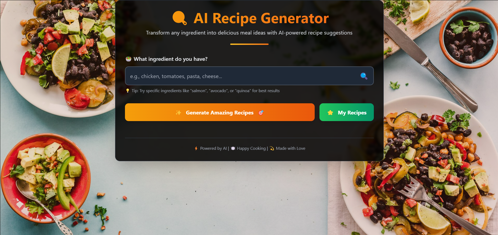
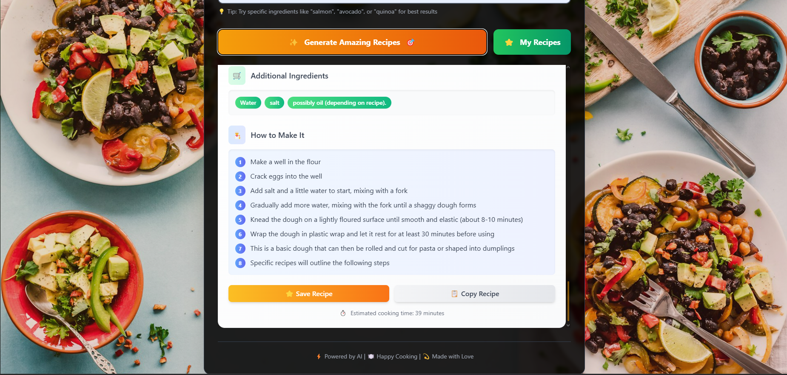
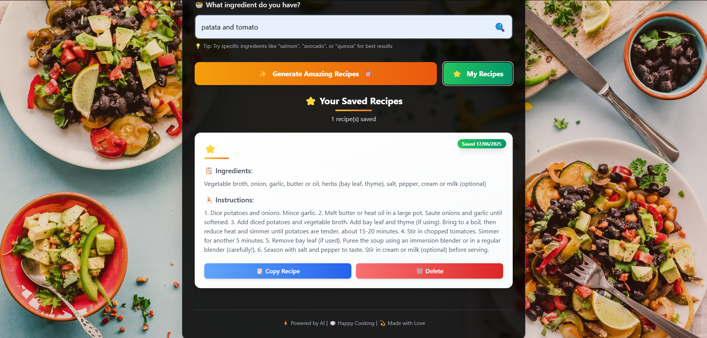

# I'm Hangry

## Project Description
I'm Hangry is a web application that helps users generate creative recipes based on a single ingredient input. Powered by the Gemini API, it provides a modern, user-friendly interface with features like recipe generation, saving recipes to local storage, copying recipes to the clipboard, and viewing or deleting saved recipes. The application is designed with a visually appealing, responsive UI using Tailwind CSS and custom animations.

## Installation Instructions
1. Clone the repository:
   ```bash
   git clone https://github.com/Ad2m1109/Food-Chatbot.git
   ```
2. Navigate to the project directory:
   ```bash
   cd im-hangry
   ```
3. Open `index.html` in a web browser to view the application. No additional setup is required as it is a frontend-only application.

## Usage Examples
- **Generate Recipes**: Enter an ingredient (e.g., "chicken" or "avocado") in the input field and click "Generate Amazing Recipes" or press Enter to receive AI-generated recipe suggestions.
- **Save Recipes**: Click "Save Recipe" on a recipe card to store it in your browser's local storage.
- **View Saved Recipes**: Click "My Recipes" to see all saved recipes, with options to copy or delete them.
- **Copy Recipes**: Use the "Copy Recipe" button to copy a recipe's details to your clipboard for sharing or saving elsewhere.

## Screenshots
Below are screenshots of the I'm Hangry application, showcasing its key features and interface:

1. **Home Screen**: The main interface where users input an ingredient to generate recipes.
   

2. **Recipe Results**: A view of generated recipe cards with ingredients and instructions.
   

3. **Saved Recipes**: The "My Recipes" section displaying saved recipes with options to copy or delete.
   

*Note*: Replace the placeholder image paths (`screenshots/*.png`) with actual screenshot files in a `screenshots` folder within the repository.

## Contributing Guidelines
Contributions are welcome! Please follow these steps:
1. Fork the repository.
2. Create a new branch for your feature or bug fix:
   ```bash
   git checkout -b feature/your-feature-name
   ```
3. Make your changes and commit them with a clear message:
   ```bash
   git commit -m "Add your descriptive commit message"
   ```
4. Push your branch to your forked repository:
   ```bash
   git push origin feature/your-feature-name
   ```
5. Open a pull request detailing your changes.

## Technologies
This project uses the following technologies:
- **Frontend**: HTML, CSS, JavaScript
- **Styling**: Tailwind CSS (via CDN)
- **API**: Google Gemini API (for recipe generation)
- **Storage**: Browser Local Storage (for saving recipes)

## Contributing
Contributions are welcome. Please follow the guidelines above to ensure a smooth contribution process. Focus areas for contributions include:
- Improving accessibility (e.g., ARIA labels, keyboard navigation).
- Adding new features like recipe filtering or image integration.
- Enhancing error handling or input validation.
- Optimizing performance for large numbers of saved recipes.

## License
This project is licensed under the [Apache License 2.0](https://opensource.org/licenses/Apache-2.0).

## Contact
If you have any questions or need assistance, please reach out to [ademyoussfi57@gmail.com].

## Development Tools
We use the following development tools:
- **Code Editor**: Visual Studio Code
- **Version Control**: Git
- **Project Management**: Trello

## Notice
Copyright [2025] [Adem Youssfi]

Licensed under the Apache License, Version 2.0 (the "License");
you may not use this file except in compliance with the License.
You may obtain a copy of the License at

http://www.apache.org/licenses/LICENSE-2.0

Unless required by applicable law or agreed to in writing, software
distributed under the License is distributed on an "AS IS" BASIS,
WITHOUT WARRANTIES OR CONDITIONS OF ANY KIND, either express or implied.
See the License for the specific language governing permissions and
limitations under the License.